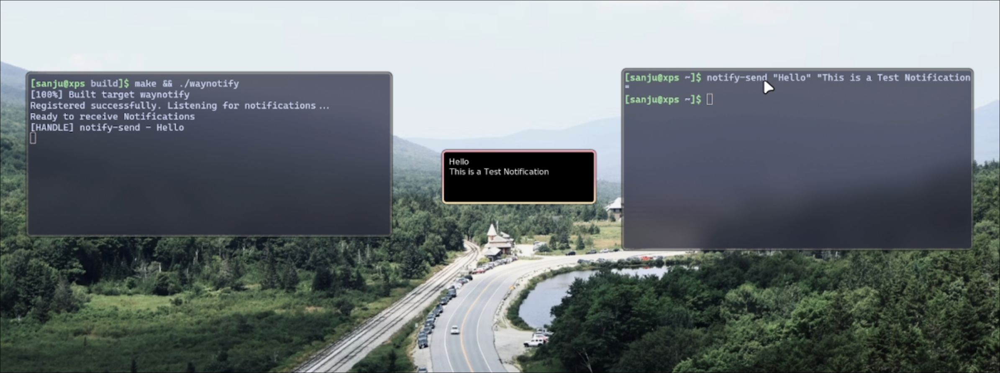

# WayNotify 🕭

A background service that listens for desktop notifications (via D-Bus), then displays them on-screen using Wayland protocols.

Learning the notification system and I'm implementing my own notification daemon for Hyprland similar to dunst.




### Libraries

- dbus
- wlroots
- SDL2
- lohmann/json


Build & Run

```
mkdir build
cd build
cmake ..
make
```


Project Tree:

```css
.
├── CMakeLists.txt
├── config.json
├── Depinstall.md
├── README.md
├── scripts
│   ├── notes.md
│   └── toggleSwayNC.sh
├── src
│   ├── config.cpp
│   ├── config.hpp
│   ├── dbus_listener.cpp
│   ├── dbus_listener.hpp
│   ├── main.cpp
│   ├── notification_handler.cpp
│   ├── notification_handler.hpp
│   ├── renderer.cpp
│   ├── renderer.hpp
│   ├── sdl_render.cpp
│   └── sdl_render.hpp
└── thoughts
    ├── 2025-05-04-Note-15-50.pdf
    └── 2025-05-04-Note-15-50.xopp
```


TODO:
- Implement notification queueing and stacking
- Add support for actions and buttons
- Improve error handling and logging
- Optimize performance and resource usage
